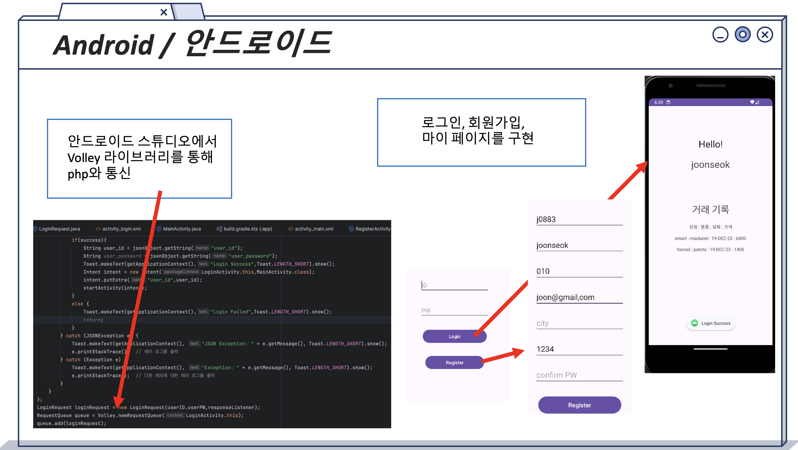
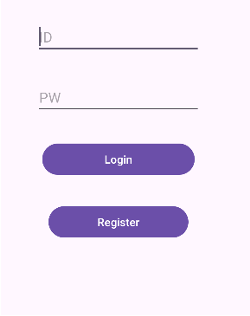
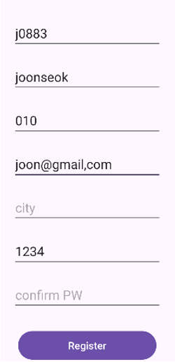
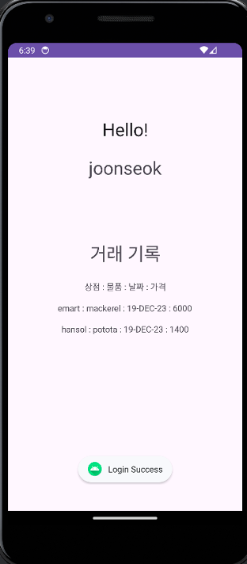

# 농수산물 거래 플랫폼 안드로이드 기능 구현
 

# Log in & create account 기능
|로그인|회원가입|거래내역|
|:-:|:-:|:-:|
||||

### 상호작용 php
- db-android-login.php
- db-android-register.php
- db-android-user_transaction.php  

[Transaction-Site-Database-Project_Web](https://github.com/chungJS/Transaction-Site-Database-Project_Web)

### 작동 흐름
1. 로그인 화면으로 시작
2. 로그인 정보를 입력해서 json오브젝트로 db-android-login.php를 통해 데이터베이스에서 조회
3. 회원가입 버튼을 통해 회원가입 
4. 회원 가입 정보 입력 후, db-android-register.php를 통해 database에 회원 등록
5. 로그인 성공하면 메인 화면에서 유저의 거래내역을 볼 수 있음
